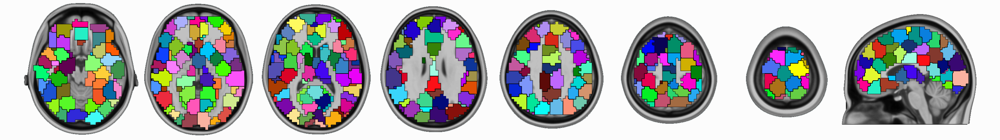



pyClusterROI is a set of python scripts for deriving a whole brain parcellation
of functional magnetic resonance imaging (fMRI) data. The resulting regions are
suitable for use as regions of interest (ROIs) in fMRI data analysis. This
method was described and evaluated in the paper: [Craddock, R. C.; James, G.
A.; Holtzheimer, P. E.; Hu, X. P. & Mayberg, H. S.  *A whole brain fMRI atlas
generated via spatially constrained spectral clustering*, Human Brain Mapping,
2012, 33, 1914-1928 doi:
10.1002/hbm.21333](http://www.ncbi.nlm.nih.gov/pubmed/21769991).

This method employs a spatially-constrained normalized-cut spectral clustering
algorithm to generate individual-level and group-level parcellations. The
spatial constraint is imposed to ensure that the resulting ROIs are spatially
coherent, i.e. the voxels in the resulting ROIs are connected. Using this
package, clustering can be performed based on either the temporal correlation
between voxel time courses, the spatial correlation between whole brain
functional connectivity maps generated from each voxel time course, or a by
spatial distance. Group level clustering can be achieved by either clustering
the average of individual connectivity maps, or a 2-level approach in which
single subject data is clustered, combined, and then submitted to another
clustering. These methods require the specification of the number of clusters
(ROIs) that the user would like to generate. 

Based on the evaluations performed in the paper, 2-level group clustering using
temporal correlation performed better than other methods. But the user might
choose a different approach based on the specific analysis that is being
performed. The group-mean approach requires much less computation, so it might
be more appropriate for very large datasets. The user might prefer spatial
correlation if they specifically want to optimize for the homogeneity of funcitonal connectivity 
maps generated from withen-ROI clusters. Although evidence from the paper
suggests that temporal correlation does a better job of optimizing the
homogeneity of FC maps then does spatial correlation. Additionally the number
of clusters generated must be determined by the type of analysis to be
performed. If the desire is to reduce the dimensionality to a low number while
preserving functional homogeneity and interpretability, then a clustering in
the range of 150 to 200 might be optimal. On the other hand, if the desire is
to provide a modest amount of dimensionality reduction, but still preserve
information present at the voxel scale, 600 - 1000 ROIs might be more
appropriate. 

Additional information can be found in a
[poster](https://www.nitrc.org/docman/view.php/427/1036/Craddock-2010-ISMRM-Parcellation-Poster.pdf)
presented at the 2010 Annual Meeting of the International Society for Magnetic
Resonance in Medicine.

